# HALIBUT OS Master Architecture Reference

**Document status:** Architecture baseline v1.0  
**Owner:** ViTech Intelligence  
**Audience:** Founders, engineering, product, security, implementation partners, investors, OEM partners, and AI coding assistants  
**Repository role:** Normative reference for implementation decisions unless superseded by an approved Architecture Decision Record (ADR)

---

## 1. Purpose

This document defines the canonical architecture for HALIBUT OS. It brings the product vision, system boundaries, intelligence engines, trust controls, deterministic workflow logic, multi-tenant security, observability, deployment topology, commercialization model, engineering standards, production-readiness requirements, and invention-supporting diagrams into one implementable reference.

HALIBUT OS is not intended to replace every ERP, CRM, WFM, MES, ITSM, security, or analytics platform. It is the operational-intelligence layer that observes those systems, constructs shared context, evaluates risk, coordinates human and machine reasoning, issues governed decisions, verifies outcomes, and learns from evidence.

The architecture therefore separates:

1. **Systems of record** — ERP, CRM, WFM, MES, HRIS, ITSM, security, finance, and industry systems.
2. **Systems of intelligence** — context graph, digital twins, forecasts, multi-agent reasoning, trust evaluation, and scenario exploration.
3. **Systems of decision** — IDIE, Decision Studio, policy gates, human approvals, deterministic state transitions, and capability authorization.
4. **Systems of action** — integration adapters, workflow execution, robotic/process automation, notifications, and approved write-back.
5. **Systems of evidence** — audit events, decision lineage, telemetry, LLM traces, evaluation results, and compliance hooks.

---

## 2. Executive vision

HALIBUT OS is the adaptive operational nervous system of an enterprise.

It enables leadership and operators to:

- see cross-domain reality rather than isolated dashboards;
- understand dependencies and likely blast radius;
- compare possible actions before committing;
- route decisions through the correct human and policy rails;
- execute through existing enterprise systems instead of bypassing them;
- verify whether the action produced the intended result;
- preserve evidence so the organization becomes more capable over time.

The product promise is expressed as a continuous operating loop:

> **Observe → Understand → Predict → Decide → Execute → Learn**

This loop is called the **OUPDEL operational loop** in the current product surface. Each loop iteration must remain attributable, replayable, policy-constrained, tenant-isolated, and safe to stop.

### 2.1 Core product principles

1. **Human authority is explicit.** High-impact actions require named approval policies and cannot be inferred from model confidence alone.
2. **AI proposes; deterministic systems authorize.** Models may generate options, explanations, or forecasts, but only policy-controlled services may authorize state transitions or external side effects.
3. **Context precedes confidence.** A high model probability is not trusted when evidence is stale, incomplete, contradictory, or outside its authorized domain.
4. **Every action has a blast radius.** Decisions are evaluated for financial, operational, workforce, customer, security, legal, and reputational impact.
5. **No hidden autonomy.** Autonomous behavior is configured, visible, bounded, reversible where possible, and logged.
6. **Tenant isolation is structural.** It is enforced in identity, policy, storage, encryption, queues, observability, and execution—not only in UI filters.
7. **Learning is evidence-based.** Outcomes, not persuasive model explanations, determine whether decision policies and agents improve.
8. **Localization is architectural.** Vietnam language, deployment, data, workflow, compliance, payment, and ERP realities are first-class concerns.
9. **Portable by design.** HALIBUT must support SaaS, private cloud, sovereign cloud, hybrid, on-premises, and OEM-embedded forms.
10. **Claims follow evidence.** Security and compliance language must match implemented controls and collected evidence.

---

## 3. System context

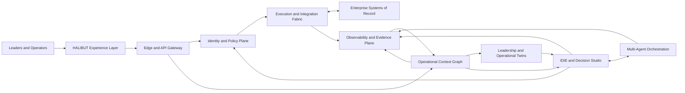

### 3.1 Architectural planes

| Plane | Responsibility | Examples |
|---|---|---|
| Experience | Role-specific command surfaces and guided workflows | Executive Command, SOC, Workforce, Approvals |
| Edge | Routing, WAF, rate limiting, request validation, localization | Cloudflare Workers, regional gateways |
| Identity and Policy | Authentication, tenant resolution, RBAC/ABAC, capability issuance | IdP adapter, policy decision point, PASETO service |
| Context and State | Events, graph, operational facts, deterministic state | Event store, graph store, relational core |
| Intelligence | Forecasts, models, agents, scenario exploration, twins | IDIE, Trust Engine, Exploration Engine |
| Decision | Candidate composition, deliberation, approval, authorization | Decision Studio, approval rails |
| Execution | Connectors, workflows, write-back, compensation | ERP adapters, queues, workflow engine |
| Evidence | Logs, metrics, traces, evaluations, audit and compliance hooks | OpenTelemetry, Opik, evidence ledger |

---

## 4. Canonical capability architecture

### 4.1 HALIBUT Leadership Twin

The **Leadership Twin** is a governed digital representation of how a leadership role frames objectives, constraints, escalation preferences, risk limits, and decision rights. It is not an impersonation system and must never claim to be the human leader.

A Leadership Twin contains:

- role and organizational mandate;
- approved objectives and weighted outcomes;
- risk appetite by domain;
- financial and operational thresholds;
- non-negotiable policies;
- escalation paths and named delegates;
- preferred evidence formats;
- historical decision patterns with provenance;
- known exceptions and temporary directives;
- effective dates and version history.

Every twin version requires:

- named human owner;
- approval timestamp;
- source evidence;
- activation and retirement dates;
- change diff;
- rollback target.

The twin may rank or explain options. It may not independently broaden its own authority.

### 4.2 IDIE Intelligence Engine

IDIE is the **Intelligent Decision Injection Engine**. Its responsibility is to transform qualified operational conditions into governed decision candidates and route them to the correct decision rail.

IDIE receives:

- triggering event or operator request;
- relevant context-graph subgraph;
- twin state;
- policy set;
- model and agent recommendations;
- health-signal status;
- impact and reversibility estimates.

IDIE produces a **Decision Envelope**:

```ts
interface DecisionEnvelope {
  decisionId: string;
  tenantId: string;
  objective: string;
  trigger: TriggerReference;
  contextSnapshotId: string;
  options: DecisionOption[];
  recommendedOptionId?: string;
  confidence: number;
  trustScore: number;
  uncertainty: UncertaintyItem[];
  blastRadius: BlastRadiusAssessment;
  policyResults: PolicyResult[];
  requiredApprovals: ApprovalRequirement[];
  executionPlan?: ExecutionPlan;
  rollbackPlan?: RollbackPlan;
  evidenceRefs: string[];
  expiresAt: string;
  stateVersion: number;
}
```

IDIE may route an envelope to:

- autonomous execution within a pre-approved low-risk capability;
- a human approver;
- a multi-agent board;
- the Exploration Engine;
- an incident or war-room workflow;
- a hold state when evidence is insufficient.

### 4.3 Operational Context Graph

The **Operational Context Graph** is HALIBUT's shared semantic model of the enterprise. It connects systems, people, assets, processes, obligations, decisions, incidents, customers, suppliers, locations, models, policies, and outcomes.

Required graph characteristics:

- tenant-scoped node and edge identifiers;
- schema versioning;
- provenance for every material fact;
- bitemporal support where business time and system-recorded time differ;
- confidence and freshness metadata;
- edge-level access controls for sensitive relationships;
- immutable references to source events;
- graph snapshots for decision replay;
- retention and deletion policies by data class.

Representative node types:

- Organization, BusinessUnit, Site, Department
- Person, Role, Team, Shift
- Customer, Supplier, Contract, SLA
- Asset, Machine, Endpoint, Application, Service
- Order, Invoice, Shipment, Ticket, Incident
- Policy, Control, Obligation, Approval
- Signal, Forecast, Scenario, Decision, Action, Outcome
- Model, Agent, Prompt, Evaluation, Evidence

The graph should use a service abstraction so the initial implementation can combine PostgreSQL and a graph projection while preserving the option to adopt a dedicated graph database later.

### 4.4 Trust Engine

The **Trust Engine** determines whether a recommendation is sufficiently supported for a specific action under a specific policy. Trust is contextual, not a permanent score attached to an agent.

Canonical Trust Score v1 inputs:

- source integrity;
- evidence freshness;
- evidence coverage;
- model calibration in the current domain;
- context completeness;
- policy compatibility;
- agent agreement and meaningful dissent;
- reversibility;
- estimated blast radius;
- historical outcome quality;
- required human confirmation.

An illustrative normalized score is:

```text
Trust = weighted(
  source_integrity,
  freshness,
  coverage,
  model_calibration,
  context_completeness,
  policy_fit,
  deliberation_quality,
  reversibility,
  inverse_blast_radius,
  outcome_history
) - uncertainty_penalties
```

The exact weights are policy-versioned by industry and decision class. Trust must never silently override an explicit prohibition, legal restriction, or mandatory human approval.

Trust Engine output includes:

- overall score;
- factor scores;
- failed hard gates;
- uncertainty list;
- missing evidence;
- recommended decision rail;
- explanation suitable for both operator and audit use.

### 4.5 Decision Studio

Decision Studio is the workspace for composing, simulating, comparing, approving, and publishing decision policies and execution plans.

It supports:

- decision templates;
- policy and threshold configuration;
- option comparison;
- blast-radius visualization;
- approval-chain design;
- rollback and compensation plans;
- simulation against historical snapshots;
- staged publication;
- signed version artifacts;
- canary activation;
- emergency disable controls.

No Studio artifact becomes executable until it passes schema validation, policy tests, simulation tests, security checks, and approval.

### 4.6 Exploration Engine

The **Exploration Engine** is a non-production-effect sandbox for branching scenarios and testing possible futures.

It may:

- clone a context snapshot;
- vary assumptions;
- run deterministic simulations;
- invoke predictive models;
- ask multiple agents for independent options;
- compare expected outcomes;
- surface uncertainty and second-order effects.

It may not directly call production connectors. Promotion from exploration to execution requires creation of a new Decision Envelope and all normal trust and approval gates.

### 4.7 Adaptive Health Signal Architecture

HALIBUT represents operational health as an adaptive, color-driven state model. Color is a visual projection of a formal machine state, not the state itself.

Canonical states:

| Color | Machine state | Meaning | Default behavior |
|---|---|---|---|
| Gray | UNKNOWN | No reliable or sufficiently fresh signal | Observe, request evidence, block automation |
| Blue | INFORMATIVE | Notable condition without material degradation | Learn, annotate, no escalation |
| Green | HEALTHY | Within approved operating envelope | Normal bounded automation |
| Yellow | WATCH | Early deviation or rising uncertainty | Increase sampling, recommend preparation |
| Orange | DEGRADED | Material deviation with service or outcome risk | Constrain autonomy, assign owner, prepare intervention |
| Red | CRITICAL | Active high-impact failure or imminent breach | Contain, escalate, require incident command |
| Purple | CONFLICTED | Strong but contradictory signals or policy conflict | Freeze affected automation, deliberate, require resolution |

Each health signal includes:

```ts
interface AdaptiveHealthSignal {
  signalId: string;
  tenantId: string;
  subjectRef: string;
  state: "UNKNOWN" | "INFORMATIVE" | "HEALTHY" | "WATCH" | "DEGRADED" | "CRITICAL" | "CONFLICTED";
  severity: number;
  confidence: number;
  trend: "IMPROVING" | "STABLE" | "WORSENING";
  observedAt: string;
  validUntil: string;
  evidenceRefs: string[];
  policyVersion: string;
  recommendedActions: string[];
}
```

Transition rules must use:

- entry thresholds;
- exit thresholds;
- hysteresis to prevent flapping;
- minimum dwell time;
- evidence freshness;
- sustained-condition windows;
- dependency propagation limits;
- human override with expiry;
- explicit recovery verification.

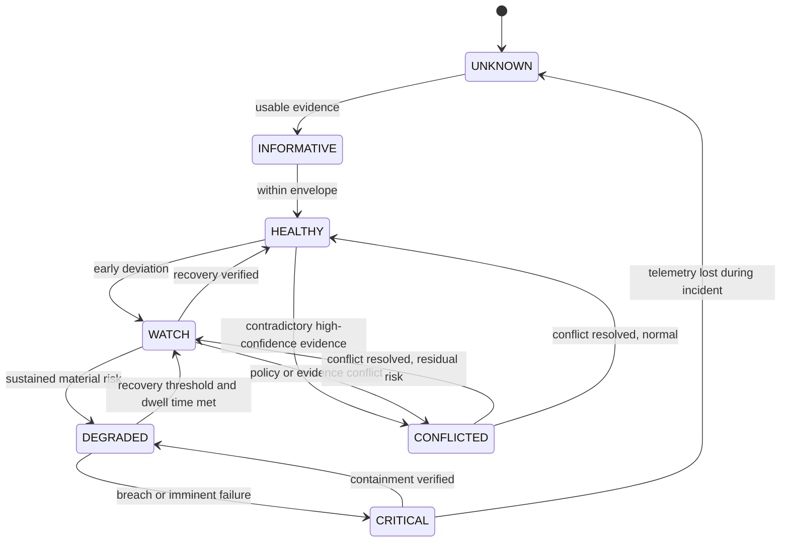

### 4.8 Deterministic State Machine

All material decisions use a deterministic state machine. AI components cannot invent state names or bypass transitions.

Canonical lifecycle:

```text
OBSERVED
→ ENRICHING
→ QUALIFIED
→ SIMULATING
→ DELIBERATING
→ AWAITING_APPROVAL
→ AUTHORIZED
→ EXECUTING
→ VERIFYING
→ LEARNING
→ CLOSED
```

Exceptional states:

```text
HELD, EXPIRED, REJECTED, FAILED, COMPENSATING, ROLLED_BACK, CANCELLED
```

Rules:

- every transition requires expected current state and state version;
- commands are idempotent;
- transitions are event-sourced;
- authorization is checked at transition time;
- action capabilities expire;
- execution and rollback are separate auditable commands;
- external side effects use an outbox or durable workflow mechanism;
- retries use bounded exponential backoff and deduplication;
- impossible transitions are rejected, not approximated.

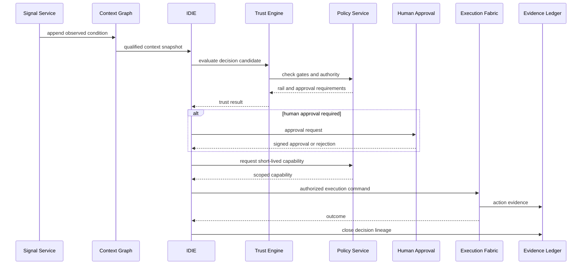

### 4.9 Digital Twin framework

HALIBUT supports multiple twin classes:

- Leadership Twin
- Organization Twin
- Process Twin
- Workforce Twin
- Asset or Machine Twin
- Customer Journey Twin
- Supply Chain Twin
- Service and Application Twin
- Security Posture Twin

All twins share:

- identity and tenant scope;
- schema and version;
- source context references;
- current state;
- constraints;
- simulation interfaces;
- observed outcomes;
- calibration metadata;
- effective and expiry dates.

Twins are projections of evidence. They do not become independent systems of record.

### 4.10 Multi-Agent orchestration

HALIBUT uses a controlled board model rather than unrestricted agent-to-agent autonomy.

Canonical roles:

- Orchestrator
- Domain Analyst
- Forecast Agent
- Risk Sentinel
- Security Sentinel
- Customer or Citizen Advocate
- Workforce Planner
- Financial Controller
- Compliance Reviewer
- Devil's Advocate
- Synthesis Agent

Agent rules:

1. Agents receive least-privilege context packets.
2. Agents cannot directly execute enterprise actions.
3. Each response includes claims, evidence references, uncertainty, and suggested checks.
4. Dissent is preserved rather than averaged away.
5. The orchestrator enforces token, time, and cost budgets.
6. Model and prompt versions are recorded.
7. Sensitive data is minimized or redacted.
8. The final recommendation is evaluated by Trust and Policy services.
9. Agent output is advisory until converted into a deterministic Decision Envelope.

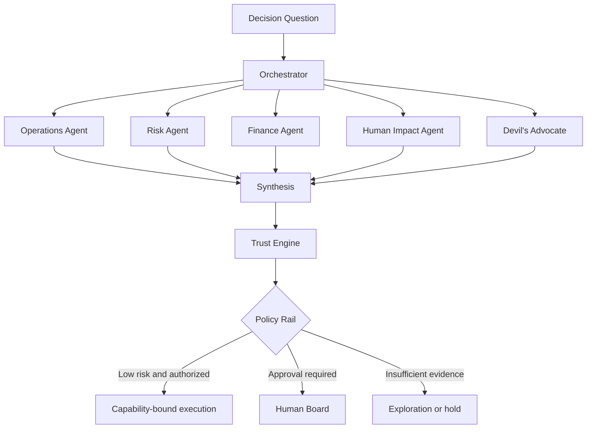

### 4.11 Blueprint AI Builder

The low-code/no-code **Blueprint AI Builder** allows users to describe workflows, integrations, policies, health signals, and decision rails using forms and assisted natural language.

The Builder must compile user intent into a declarative artifact rather than generating uncontrolled runtime code.

Compilation pipeline:

```text
Intent
→ Structured Blueprint DSL
→ Schema validation
→ Policy linting
→ Connector permission analysis
→ Simulation
→ Security tests
→ Human review
→ Signed version artifact
→ Staged deployment
```

Blueprint artifacts include:

- trigger definitions;
- input schemas;
- context queries;
- state-machine definition;
- policy references;
- decision thresholds;
- required approvals;
- connector actions;
- retry and compensation behavior;
- evidence requirements;
- test fixtures;
- ownership and lifecycle metadata.

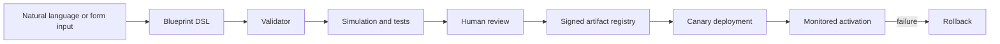

---

## 5. Vietnam-localized ERP architecture

HALIBUT integrates with QOLLAB/VietERP and other Vietnam-market ERP systems through the same connector framework used for international systems. Localization must not be implemented as scattered UI exceptions.

### 5.1 Localization services

- Vietnamese and English terminology packs;
- VND currency and local number formatting;
- Asia/Ho_Chi_Minh time handling;
- Vietnamese address and administrative-unit models;
- local tax and invoice field mappings;
- VietQR and payment-reference adapters where approved;
- local HR, payroll, attendance, and labor-workflow mapping;
- document templates and approval conventions;
- deployment profiles for Vietnam-hosted infrastructure;
- data classification and cross-border transfer controls;
- configurable retention and consent evidence.

### 5.2 ERP adapter boundary

Each ERP adapter implements:

- discovery and health check;
- read models;
- event subscription or scheduled extraction;
- canonical schema mapping;
- write commands with idempotency keys;
- permission manifest;
- retry and compensation behavior;
- audit evidence;
- version compatibility matrix.

Legal and regulatory requirements must be validated by qualified local counsel and customer-specific compliance owners. The architecture provides control points and evidence; it does not itself constitute legal compliance.

---

## 6. SaaS and PaaS multi-tenant security

### 6.1 Tenant model

HALIBUT supports:

- shared SaaS with logical isolation;
- dedicated database or schema per tenant;
- dedicated namespace or cluster;
- private cloud;
- customer-managed sovereign deployment;
- OEM-embedded tenant hierarchies.

Every request, event, object, policy evaluation, trace, queue message, and encryption context carries a verified `tenant_id`.

Tenant scope is derived from authenticated membership and must never be accepted from an untrusted client without verification.

### 6.2 Control plane and data plane

**Control plane:** tenant provisioning, identity federation, policy administration, blueprint registry, licensing, deployment configuration, feature entitlements.

**Data plane:** operational events, context graph, twins, decisions, workflows, connectors, evidence, and tenant-specific AI workloads.

High-assurance deployments may use a shared control plane with isolated customer data planes.

### 6.3 Data isolation controls

- PostgreSQL row-level security or isolated schemas/databases;
- tenant-keyed encryption context;
- per-tenant object-storage prefixes and policies;
- tenant-specific queue partitions;
- cache keys that always include tenant identity;
- graph partition validation;
- redacted observability fields;
- separate secrets and connector credentials;
- automated cross-tenant access tests.

### 6.4 RBAC and ABAC

HALIBUT combines:

- **RBAC** for stable organizational roles and module permissions;
- **ABAC** for dynamic decisions based on tenant, environment, resource, data class, location, decision impact, time, incident state, device posture, and approval status.

Example policy question:

```text
Can subject S perform action A on resource R
for tenant T in environment E,
with decision impact I,
under policy version P,
using capability C?
```

Policy decisions return `ALLOW`, `DENY`, or `REQUIRE_APPROVAL`, plus reason codes and evidence requirements.

### 6.5 Hardened protocols

- TLS 1.3 where supported;
- mTLS for internal service identities;
- workload identity instead of long-lived shared secrets;
- signed webhooks with timestamp and replay protection;
- request body limits and schema validation;
- idempotency keys for commands;
- nonce and sequence checks for sensitive actions;
- secret rotation;
- deny-by-default network policies;
- egress allowlists for high-assurance environments.

### 6.6 PASETO v4 capability tokens

PASETO v4 tokens are used for short-lived, narrowly scoped internal capabilities. They are not a replacement for user authentication or server-side authorization.

Recommended capability claims:

```json
{
  "iss": "halibut-policy-service",
  "sub": "workflow-instance-id",
  "aud": "erp-connector-service",
  "tenant_id": "tenant-id",
  "action": "purchase_order.approve",
  "resource": "po/12345",
  "decision_id": "DEC-2401",
  "policy_version": "policy-2026-06-01",
  "max_uses": 1,
  "jti": "unique-token-id",
  "iat": "timestamp",
  "exp": "short-expiry"
}
```

Controls:

- use signed `v4.public` capabilities when recipients must verify without sharing signing keys;
- keep expiration short;
- bind token to tenant, action, resource, and decision;
- reject replay using `jti` or one-time-use storage;
- rotate keys through a managed key service;
- include key identifier and purpose in authenticated footer metadata;
- never place broad admin capabilities in browser storage.

---

## 7. Evidence, observability, and compliance hooks

### 7.1 OpenTelemetry architecture

All services emit standardized traces, metrics, and logs through OpenTelemetry.

Recommended flow:

```text
Application SDKs
→ node or pod collectors
→ regional collector gateway
→ processing, redaction, sampling, tenant routing
→ approved observability backends
```

The collector tier is vendor-neutral and separates application instrumentation from backend choice.

Required attributes include:

- tenant ID or pseudonymous tenant reference;
- environment;
- service and version;
- trace and correlation IDs;
- decision ID;
- workflow instance ID;
- model and prompt versions where applicable;
- policy version;
- data classification;
- error and retry category.

Sensitive payloads must not be emitted by default.

### 7.2 Opik integration

Opik is the LLM and agent observability layer for:

- prompt and model version tracking;
- agent traces;
- token and latency cost;
- tool-call behavior;
- evaluation datasets;
- hallucination, relevance, context-recall, and policy-adherence evaluations;
- regression comparisons;
- human feedback.

For private or regulated deployments, Opik should be self-hosted in the same approved infrastructure boundary, typically Kubernetes, with tenant-aware access, redaction, and retention.

### 7.3 SOC 2 evidence hooks

HALIBUT does not claim SOC 2 compliance merely by including these hooks. The architecture provides evidence collection points that can support a formal control program.

Evidence hooks include:

- access grants and revocations;
- authentication and federation events;
- privileged actions;
- policy changes;
- deployment approvals;
- code and dependency scan results;
- backup completion and restore tests;
- incident timelines;
- security alert handling;
- vendor and connector inventories;
- encryption and key-rotation events;
- disaster-recovery exercises;
- model and prompt changes;
- decision approvals and overrides;
- data export and deletion requests.

Evidence records should be immutable or append-only, timestamped, attributable, retained by policy, and exportable to an auditor-controlled package.

---

## 8. API gateway and integration framework

### 8.1 Edge gateway

Cloudflare Workers may provide:

- DNS and TLS termination;
- WAF and bot controls;
- regional request handling;
- authentication pre-checks;
- rate limiting;
- localization;
- request normalization;
- static and cached product experiences;
- routing to regional or customer-specific data planes.

Sensitive authorization and business-policy decisions remain in trusted server services.

### 8.2 Internal API model

- REST or GraphQL for user-facing query surfaces;
- command APIs for state transitions;
- event streaming for operational facts;
- gRPC where low-latency internal contracts justify it;
- asynchronous workflows for long-running actions;
- schema registry and versioned contracts.

Every command API requires:

- authenticated subject or workload;
- verified tenant;
- action and resource authorization;
- idempotency key;
- expected state version;
- correlation and decision IDs;
- validated schema;
- audit event.

### 8.3 Connector framework

Connector types:

- polling readers;
- event or webhook receivers;
- change-data-capture adapters;
- command executors;
- file and document exchange;
- human task adapters;
- industrial or OT gateways.

Connectors run with least privilege and publish a machine-readable permission manifest. High-risk connectors may be isolated in dedicated namespaces or customer networks.

---

## 9. Production deployment architecture

### 9.1 Reference topology

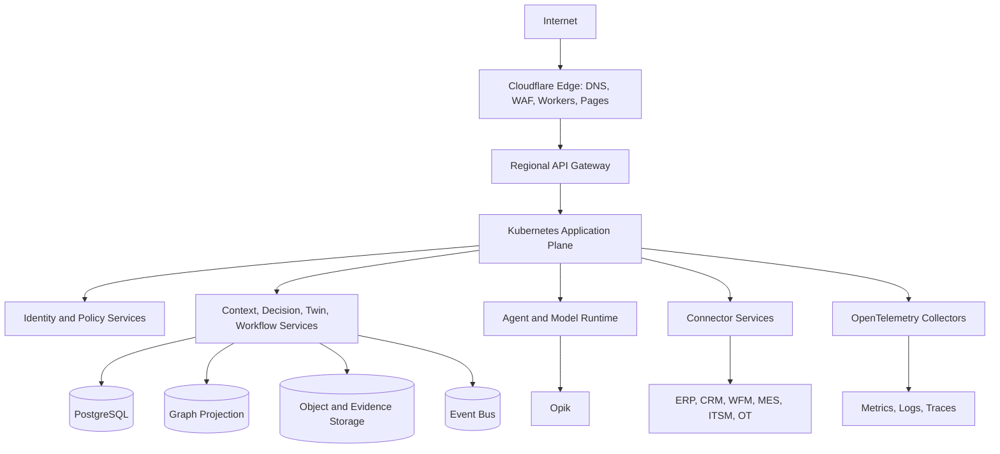

### 9.2 Deployment profiles

#### Profile A — Cloud-native SaaS

- Cloudflare edge and Workers;
- managed Kubernetes on AWS;
- managed PostgreSQL and object storage;
- managed event streaming;
- centralized observability and tenant-isolated data controls.

#### Profile B — Vietnam sovereign or private cloud

- Cloudflare edge where contractually appropriate;
- Kubernetes on VNG Cloud or customer-approved Vietnam infrastructure;
- Vietnam-hosted database, object storage, keys, telemetry, and Opik;
- restricted cross-border data flows;
- local backup and recovery site.

#### Profile C — Hybrid enterprise

- edge and control plane in managed cloud;
- customer data plane and connectors inside customer network;
- outbound-only secure tunnel where required;
- local execution gateway and evidence buffering;
- policy-controlled synchronization.

#### Profile D — OEM embedded

- white-label experience components;
- isolated policy and data plane;
- partner identity federation;
- product entitlements and licensing service;
- signed extension and connector packages.

### 9.3 Kubernetes design

- separate namespaces by environment and optionally tenant;
- network policies;
- workload identity;
- pod security standards;
- admission policies;
- signed images and software bill of materials;
- horizontal and event-driven autoscaling;
- disruption budgets;
- anti-affinity for critical replicas;
- secrets from a managed secret store;
- GitOps deployment and drift detection;
- progressive delivery and automated rollback.

### 9.4 Data architecture

Recommended initial foundation:

- PostgreSQL for tenant, identity mapping, policy metadata, decision state, workflow state, and operational read models;
- append-only event storage for replay and audit lineage;
- object storage for documents, evidence, models, and exports;
- Redis-compatible cache for bounded ephemeral state, never authoritative permissions;
- search index for operator discovery;
- graph projection derived from canonical events and relational identities.

---

## 10. Disaster recovery and resilience

### 10.1 Service tiers

| Tier | Examples | Target RTO | Target RPO |
|---|---|---:|---:|
| Tier 0 | Identity, policy, state machine, audit, emergency controls | 15–30 min | near-zero to 5 min |
| Tier 1 | Context, decisions, workflow, connectors | 1 hour | 15 min |
| Tier 2 | Exploration, noncritical analytics, reports | 4 hours | 1 hour |
| Tier 3 | Historical training and noncritical archives | 24 hours | 24 hours |

Targets are deployment objectives and must be contractually confirmed per customer.

### 10.2 Resilience controls

- multi-zone deployment;
- database point-in-time recovery;
- encrypted cross-zone or cross-region backup;
- tested restore automation;
- durable queues and outbox pattern;
- connector circuit breakers;
- degraded read-only mode;
- emergency autonomy-disable switch;
- buffered evidence during downstream outage;
- dependency health propagation;
- chaos and failover exercises;
- documented manual operating procedures.

### 10.3 Recovery principles

1. Restore authority and audit before restoring automation.
2. Reconcile state before replaying commands.
3. Never repeat an external side effect without idempotency proof.
4. Mark uncertain outcomes for human review.
5. Preserve incident evidence and recovery decisions.

---

## 11. Commercialization and OEM embedding

### 11.1 Commercial forms

- **HALIBUT SaaS:** shared or dedicated managed service.
- **HALIBUT Private:** customer-managed or ViTech-managed private deployment.
- **HALIBUT PaaS:** APIs, decision kernel, context graph, policy, and orchestration for partner applications.
- **HALIBUT OEM:** embedded or white-label capabilities inside ERP, BPO, industrial, education, government, and vertical products.
- **HALIBUT Industry Packs:** schemas, policies, twin templates, workflows, connectors, dashboards, and evaluation datasets for a target sector.

### 11.2 OEM boundary

OEM partners may customize:

- brand and experience;
- terminology and localization;
- industry pack;
- connectors;
- approved model providers;
- deployment profile;
- commercial entitlements.

They may not disable immutable audit, tenant isolation, capability scoping, or mandatory high-impact approval controls without creating a separately reviewed product profile.

---

## 12. Industry packs

Each pack includes canonical entities, signals, health states, decision templates, policy examples, integrations, twin templates, KPIs, risk patterns, and evaluation datasets.

### 12.1 Manufacturing

- production lines, work orders, OEE, quality, maintenance, suppliers;
- machine and process twins;
- downtime and quality blast radius;
- MES, ERP, IoT, energy, maintenance connectors.

### 12.2 BPO and contact centers

- forecast, staffing, schedules, SLA, occupancy, shrinkage, queues, quality;
- workforce and customer-impact twins;
- real-time interval decisions;
- WFM, ACD, CRM, QA, HR, and payroll connectors.

### 12.3 Government

- agencies, services, cases, citizens, obligations, approvals;
- sovereign deployment and granular audit;
- accessibility and bilingual workflows;
- strict human authority and records-management profiles.

### 12.4 Healthcare

- care operations, capacity, equipment, staffing, incidents;
- strong data minimization and clinical-boundary controls;
- no autonomous clinical treatment decisions;
- health-information access and evidence policies.

### 12.5 Logistics

- orders, routes, vehicles, warehouses, temperature, customs, delivery;
- supply-chain and fleet twins;
- delay, loss, cold-chain, and capacity scenarios.

### 12.6 Education

- institutions, courses, learners, instructors, pathways, interventions;
- privacy-conscious learner and workforce readiness models;
- human approval for consequential learner decisions.

### 12.7 Financial services

- accounts, transactions, customers, controls, fraud alerts, service operations;
- strict separation of recommendation and regulated authorization;
- explainability, model risk, and immutable evidence.

### 12.8 Semiconductor

- fabs, tools, lots, recipes, yield, defects, maintenance, suppliers;
- high-volume telemetry and traceability;
- process, asset, and supply-chain twins;
- edge processing and intellectual-property isolation.

---

## 13. Full implementation roadmap

### Phase 0 — Architecture and repository baseline

**Outcome:** one source of truth, direct GitHub deployment, honest demo boundary.

- adopt this master architecture;
- create ADR process;
- remove Lovable build dependency;
- harden demonstration identity handling;
- add tests, CI, deployment configuration, and documentation;
- classify all current UI features as demo, pilot, or production target.

### Phase 1 — Product shell and tenant foundation

**Outcome:** authenticated, tenant-aware application skeleton.

- production identity provider adapter;
- organization, membership, role, and environment model;
- tenant-aware API gateway;
- PostgreSQL with row-level security;
- policy service and audit event service;
- initial control-plane administration.

### Phase 2 — Context and deterministic decision kernel

**Outcome:** reliable operational facts and governed decision lifecycle.

- canonical event schemas;
- context graph service and projections;
- decision state machine;
- Decision Envelope schema;
- approval service;
- outbox and durable workflow execution;
- evidence ledger.

### Phase 3 — Trust, IDIE, and digital twins

**Outcome:** explainable, policy-aware intelligence.

- Trust Engine v1;
- IDIE routing;
- Leadership Twin and Operational Twin schemas;
- blast-radius assessment;
- health-signal state machine;
- Exploration Engine sandbox.

### Phase 4 — Multi-agent and observability platform

**Outcome:** controlled agent board with measurable quality.

- agent orchestrator;
- model gateway;
- prompt and model registry;
- OpenTelemetry instrumentation;
- Opik self-hosting or approved managed deployment;
- evaluation datasets and release gates;
- cost, latency, and safety budgets.

### Phase 5 — Integration and Blueprint Builder

**Outcome:** repeatable implementation without custom code for every workflow.

- connector SDK;
- QOLLAB/VietERP adapter pack;
- common ERP, CRM, WFM, ITSM, and observability adapters;
- Blueprint DSL;
- validator, simulator, artifact registry, and canary deployment.

### Phase 6 — Industry pilot

**Outcome:** one measurable production pilot.

- select one primary industry and customer workflow;
- define baseline metrics and decision rights;
- operate in recommendation-only mode;
- enable bounded actions after evidence review;
- complete recovery, security, privacy, and operational acceptance tests.

### Phase 7 — Commercial scale

**Outcome:** repeatable SaaS, private, and OEM deployments.

- licensing and entitlements;
- dedicated deployment automation;
- industry packs;
- partner/OEM SDK;
- formal control program and audit readiness;
- regional support, service management, and disaster recovery.

---

## 14. Engineering coding standards

### 14.1 General

- TypeScript strict mode for frontend and Node services.
- Explicit domain types; avoid unvalidated `any`.
- Schema validation at every external boundary.
- Contract-first APIs and versioned events.
- Pure domain logic separated from frameworks and transport.
- Deterministic functions for policy, trust, and state transitions.
- UTC storage and explicit display time zones.
- Structured errors with stable reason codes.
- No secrets, tokens, or sensitive payloads in source or logs.

### 14.2 Repository structure target

```text
apps/
  web/
  edge-api/
  admin/
services/
  identity-policy/
  context-graph/
  decision-kernel/
  workflow-execution/
  trust-engine/
  agent-orchestrator/
  evidence-ledger/
packages/
  contracts/
  domain/
  policy-sdk/
  connector-sdk/
  blueprint-dsl/
  ui/
infra/
  terraform/
  kubernetes/
  cloudflare/
docs/
  adr/
  runbooks/
  threat-models/
```

### 14.3 Testing

- unit tests for domain functions and transitions;
- contract tests for APIs and events;
- policy tests for allow, deny, and approval cases;
- tenant-isolation tests;
- integration tests with connector sandboxes;
- deterministic simulation tests;
- end-to-end tests for critical operator journeys;
- security tests and dependency scans;
- load, soak, recovery, and chaos tests before production.

### 14.4 AI coding-assistant rules

AI coding assistants must:

1. read this document and relevant ADRs before changing architecture;
2. preserve tenant, policy, audit, and deterministic-state boundaries;
3. never add direct model-to-connector execution;
4. never invent compliance status;
5. add or update tests with each behavioral change;
6. use existing schemas and reason codes;
7. document assumptions and unresolved questions;
8. avoid introducing a second framework for an already solved concern;
9. keep secrets and customer data out of prompts;
10. submit small, reviewable changes.

---

## 15. Production-readiness checklist

### Product and governance

- [ ] Named product owner and operational owner
- [ ] Defined decision rights and prohibited autonomous actions
- [ ] Customer-approved policies and escalation paths
- [ ] Clear demo, pilot, and production labeling
- [ ] Legal and regulatory review completed

### Identity and security

- [ ] Production IdP and federation tested
- [ ] Server-side RBAC/ABAC enforced
- [ ] Tenant isolation tests pass
- [ ] Secrets and keys managed and rotated
- [ ] PASETO capabilities scoped, short-lived, and replay-protected
- [ ] Threat model reviewed
- [ ] WAF, rate limits, and abuse controls enabled
- [ ] Vulnerability and dependency scans pass

### Data

- [ ] Data inventory and classification complete
- [ ] Retention, deletion, export, and residency policies implemented
- [ ] Backup and restore tested
- [ ] Encryption at rest and in transit verified
- [ ] Graph provenance and snapshot replay verified

### Decisions and automation

- [ ] State-machine transition tests pass
- [ ] Hard policy gates cannot be bypassed
- [ ] Human approval signatures are attributable
- [ ] Idempotency and compensation tested
- [ ] Emergency stop and read-only mode tested
- [ ] Uncertain outcomes route to review

### AI and models

- [ ] Model and prompt versions recorded
- [ ] Evaluation dataset defined
- [ ] Quality, safety, latency, and cost gates pass
- [ ] Agent tool permissions use least privilege
- [ ] Sensitive context redaction tested
- [ ] Human override and model-disable controls verified

### Reliability and operations

- [ ] SLOs and alerting defined
- [ ] OpenTelemetry traces, metrics, and logs available
- [ ] Opik evaluations and traces available for AI paths
- [ ] Runbooks completed
- [ ] On-call and incident roles assigned
- [ ] DR exercise meets target RTO/RPO
- [ ] Capacity and load tests pass

### Release

- [ ] CI checks pass
- [ ] Signed build artifacts and SBOM available
- [ ] Change approval recorded
- [ ] Canary or staged release completed
- [ ] Rollback verified
- [ ] Post-release validation complete

---

## 16. Investor architecture appendix

### 16.1 Defensible system layers

HALIBUT's defensibility is expected to come from the interaction of multiple layers rather than a single model:

1. operational context ontology and graph mappings;
2. deterministic decision and approval kernel;
3. adaptive health-signal architecture;
4. Trust Engine factorization and evidence routing;
5. Leadership and industry twin templates;
6. multi-agent board protocol with preserved dissent;
7. Blueprint DSL and deployment compiler;
8. connector and industry-pack ecosystem;
9. outcome evidence and evaluation datasets;
10. Vietnam-localized deployment and ERP integration capability.

### 16.2 Commercial leverage

- a shared decision kernel supports multiple industries;
- industry packs reduce implementation time;
- private and sovereign deployment expand addressable markets;
- OEM embedding creates distribution through existing platforms;
- observability and evidence reduce enterprise adoption risk;
- bounded automation allows customers to begin in recommendation-only mode and increase autonomy gradually.

### 16.3 Architecture-stage honesty

The current repository is a sophisticated interactive demonstration. The production moat will exist only as the deterministic kernel, tenant security, evidence layer, connectors, industry packs, and measured outcomes are implemented and operated.

---

## 17. Patent-oriented system logic diagrams

These diagrams are technical invention-disclosure aids, not legal patent claims. Patent counsel should determine novelty, claim scope, inventorship, and filing strategy.

### 17.1 Context-to-capability decision chain

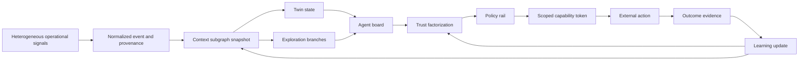

### 17.2 Adaptive signal propagation with blast-radius control

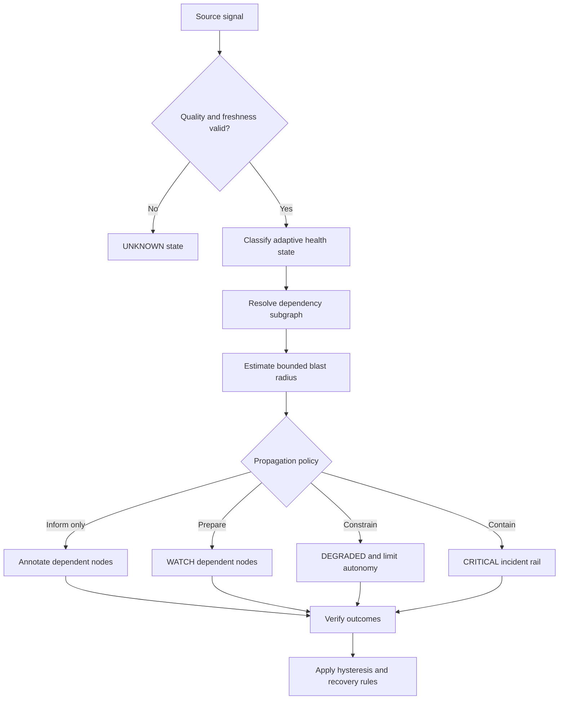

### 17.3 Human-governed multi-agent execution

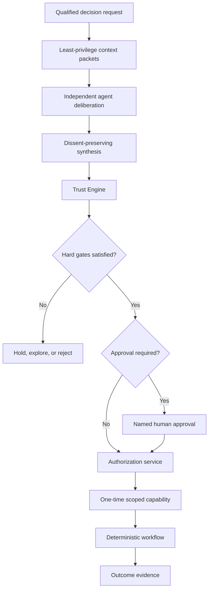

### 17.4 Blueprint compilation and safe activation

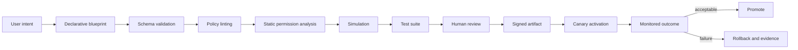

### 17.5 Tenant-isolated decision execution

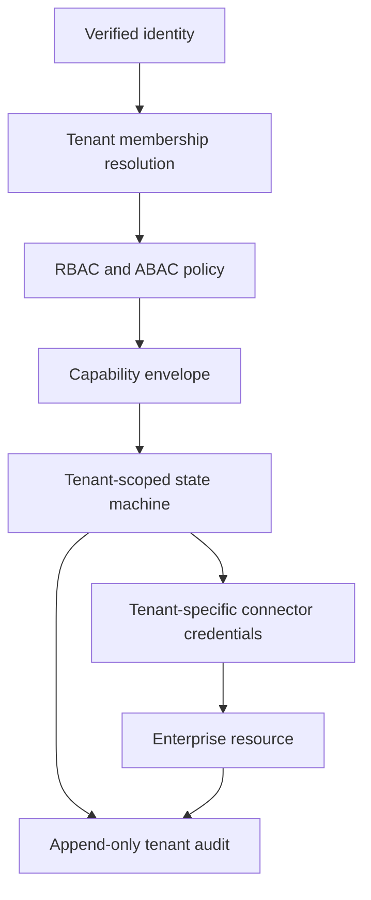

---

## 18. Architecture governance

Any material deviation from this reference requires an ADR describing:

- context and problem;
- decision;
- alternatives considered;
- security and tenant impact;
- operational impact;
- migration and rollback;
- owner and approval date.

This document should be reviewed at each major implementation phase and at least quarterly during active product development.

---

## 19. Current implementation directive

For the current repository hardening branch, engineering should prioritize:

1. direct GitHub build and deployment;
2. honest demonstration labeling;
3. testable session and role behavior;
4. route-level performance improvements;
5. deployment and security documentation;
6. architecture alignment between the current UI modules and this target design.

Production services should be introduced incrementally behind stable contracts rather than rewriting the product surface in one step.
